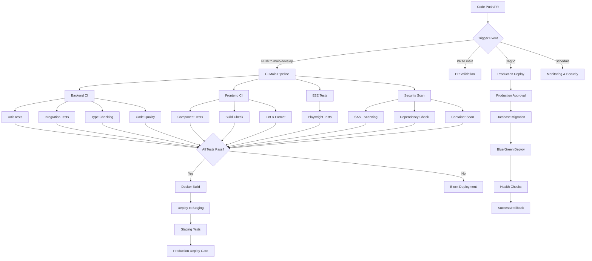

# Legal AI System - CI/CD Pipeline Documentation

This directory contains the complete CI/CD pipeline implementation for the Legal AI System using GitHub Actions. The pipeline provides comprehensive automation for testing, building, security scanning, and deployment across multiple environments.

## 📋 Pipeline Overview

The CI/CD pipeline consists of the following workflows:

### 🚀 Core Workflows

1. **`ci-main.yml`** - Main CI pipeline with comprehensive testing and quality checks
2. **`docker-build.yml`** - Docker image building and container registry management
3. **`deploy-production.yml`** - Production deployment with approval gates and rollback
4. **`deploy-staging.yml`** - Staging deployment with PR integration and testing
5. **`security-compliance.yml`** - Security scanning and compliance validation
6. **`monitoring-alerts.yml`** - System monitoring and alerting
7. **`infrastructure.yml`** - Infrastructure as Code management
8. **`automated-testing.yml`** - Comprehensive test suite execution

## 🏗️ Pipeline Architecture



## 🔧 Workflow Details

### Main CI Pipeline (`ci-main.yml`)

**Triggers:**
- Push to `main`, `develop` branches
- Pull requests to `main`, `develop`
- Manual workflow dispatch

**Features:**
- Multi-language testing (Python, TypeScript)
- Parallel job execution for performance
- Comprehensive security scanning
- Code quality checks (linting, type checking)
- Test coverage reporting
- Artifact generation and caching

**Jobs:**
1. **Security Scan** - Trivy, Semgrep, TruffleHog secret detection
2. **Backend CI** - Python testing with pytest, mypy, bandit
3. **Frontend CI** - Node.js testing with Jest, ESLint, Prettier
4. **E2E Tests** - Playwright browser testing
5. **Build Summary** - Results aggregation and notifications

### Docker Build Pipeline (`docker-build.yml`)

**Triggers:**
- Push to `main`, `develop` branches
- Tags matching `v*`
- Pull requests to `main`
- Manual workflow dispatch

**Features:**
- Multi-architecture builds (AMD64, ARM64)
- Container security scanning
- SBOM generation
- Multi-stage Dockerfile optimization
- Container registry management

**Matrix Strategy:**
- Backend (FastAPI)
- Frontend (Next.js)
- NGINX (Reverse Proxy)
- Celery Workers (Background Tasks)

### Production Deployment (`deploy-production.yml`)

**Triggers:**
- Version tags (`v*`)
- Manual workflow dispatch with approvals

**Features:**
- Manual approval gates (2+ approvers required)
- Database migration with rollback capability
- Blue/green deployment strategy
- Health check validation
- Automatic rollback on failure
- Post-deployment verification

**Deployment Steps:**
1. Pre-deployment validation
2. Database backup and migration
3. Kubernetes deployment
4. Health verification
5. Post-deployment tasks
6. Success notification

### Staging Deployment (`deploy-staging.yml`)

**Triggers:**
- Push to `develop` branch
- PR labeled with `deploy-staging`
- Manual workflow dispatch

**Features:**
- Automatic PR deployment
- Integration testing against live environment
- Performance baseline validation
- PR status updates with deployment links
- Automatic cleanup of old deployments

### Security & Compliance (`security-compliance.yml`)

**Triggers:**
- Push to `main`, `develop` branches
- Daily scheduled scans (2 AM UTC)
- Manual workflow dispatch

**Security Scans:**
- **SAST:** Bandit, ESLint, Semgrep, CodeQL
- **Dependencies:** Safety, npm audit, Snyk
- **Containers:** Trivy, Grype, Anchore
- **Infrastructure:** Checkov, KubeSec
- **Secrets:** TruffleHog, detect-secrets

**Compliance Checks:**
- GDPR/CCPA privacy regulations
- Legal industry standards (ABA Model Rules)
- SOC 2 Type II requirements
- Attorney-client privilege protection

### Monitoring & Alerting (`monitoring-alerts.yml`)

**Triggers:**
- Scheduled (every 15 minutes during business hours)
- Manual workflow dispatch

**Monitoring Areas:**
- Application health and uptime
- Performance metrics and response times
- Security posture and SSL certificates
- Compliance status and audit logs
- Resource utilization and capacity

**Alert Channels:**
- Slack notifications for different severity levels
- GitHub issues for critical problems
- Status badge updates
- PagerDuty integration (optional)

### Infrastructure as Code (`infrastructure.yml`)

**Triggers:**
- Changes to `terraform/`, `kubernetes/`, `ansible/` directories
- Manual workflow dispatch

**Features:**
- Terraform plan/apply automation
- Kubernetes manifest validation
- Ansible playbook testing
- Infrastructure drift detection
- Multi-environment support

### Automated Testing Suite (`automated-testing.yml`)

**Triggers:**
- Push to main branches
- Daily comprehensive testing (3 AM UTC)
- Manual workflow dispatch

**Test Categories:**
- **Unit Tests:** Backend (pytest), Frontend (Jest)
- **Integration Tests:** API, Database, Storage, AI services
- **E2E Tests:** Playwright browser automation
- **Performance Tests:** K6 load testing, Artillery
- **Security Tests:** OWASP ZAP, Nuclei vulnerability scanning
- **Legal Compliance:** GDPR, attorney-client privilege, audit requirements

## 🔐 Security & Secrets Management

### Required Secrets

#### GitHub Repository Secrets
```bash
# Container Registry
GITHUB_TOKEN                    # Automatic (GitHub provides)

# Cloud Infrastructure  
AWS_ROLE_ARN                   # AWS IAM role for OIDC
KUBECONFIG                     # Kubernetes cluster configuration
KUBECONFIG_STAGING             # Staging cluster configuration

# External Services
OPENAI_API_KEY                 # OpenAI API access
ANTHROPIC_API_KEY              # Anthropic Claude API access
OPENAI_TEST_API_KEY           # Test API key (limited quota)
ANTHROPIC_TEST_API_KEY        # Test API key (limited quota)
SNYK_TOKEN                    # Snyk vulnerability scanning

# Testing & Monitoring
E2E_TEST_USER_EMAIL           # End-to-end test user credentials
E2E_TEST_USER_PASSWORD        
E2E_TEST_ADMIN_EMAIL          # Admin test credentials
E2E_TEST_ADMIN_PASSWORD       
STAGING_TEST_USER_EMAIL       # Staging environment test user
STAGING_TEST_USER_PASSWORD    
MONITORING_API_TOKEN          # System monitoring API access
COMPLIANCE_TEST_API_TOKEN     # Compliance testing API access

# Notifications
SLACK_WEBHOOK_URL             # General notifications
SLACK_WEBHOOK_URL_SECURITY    # Security-specific alerts
```

#### GitHub Repository Variables
```bash
# Infrastructure
AWS_REGION                    # Primary AWS region
TERRAFORM_STATE_BUCKET        # Terraform state storage
PRODUCTION_APPROVERS         # Required approvers for production (comma-separated GitHub usernames)
```

### Secret Rotation Policy

- **API Keys:** Rotate quarterly or after security incidents
- **Database Credentials:** Rotate monthly using AWS Secrets Manager
- **Container Registry:** Use OIDC tokens (automatic rotation)
- **Kubernetes Certificates:** Managed by cert-manager (automatic)

## 🚀 Deployment Strategies

### Environment Promotion Flow

```
Feature Branch → Develop → Staging → Production
     ↓              ↓         ↓          ↓
   PR Tests    Auto Deploy  Manual    Approval +
                             Tests    Blue/Green
```

### Deployment Gates

1. **Development:** All tests must pass
2. **Staging:** Security scans + integration tests
3. **Production:** Manual approval + comprehensive validation

### Rollback Procedures

**Automatic Rollback Triggers:**
- Health check failures after deployment
- Critical error rate increase
- Database migration failures

**Manual Rollback:**
- Use workflow dispatch with `rollback: true`
- Restores previous container images
- Reverts database migrations if needed

## 📊 Monitoring & Observability

### Key Metrics Tracked

**Application Metrics:**
- Request rate and response time
- Error rates and status codes
- Database connection pool usage
- Celery queue lengths and processing times

**Security Metrics:**
- Failed authentication attempts
- SSL certificate expiration dates
- Vulnerability scan results
- Compliance check status

**Infrastructure Metrics:**
- CPU and memory utilization
- Storage usage and capacity
- Network throughput
- Container health and restart counts

### Alerting Thresholds

**Critical Alerts (Immediate Response):**
- Application downtime > 1 minute
- Error rate > 5%
- SSL certificate expiring < 7 days
- Critical vulnerabilities detected
- Storage usage > 90%

**Warning Alerts (Investigation Required):**
- Response time > 3 seconds average
- CPU utilization > 80%
- Memory usage > 85%
- Queue backlog > 100 items

## 🔧 Development Workflow

### Pull Request Process

1. **Create Feature Branch**
   ```bash
   git checkout -b feature/legal-document-analysis
   ```

2. **Implement Changes**
   - Follow coding standards (enforced by linters)
   - Add comprehensive tests
   - Update documentation

3. **Push and Create PR**
   ```bash
   git push origin feature/legal-document-analysis
   ```
   - Automated tests run on PR creation
   - Code quality checks enforced
   - Security scans performed

4. **PR Review & Approval**
   - Require 1+ code reviews
   - All CI checks must pass
   - Security scan approval needed

5. **Staging Deployment** (Optional)
   - Add `deploy-staging` label for testing
   - Automatic deployment to staging environment
   - Integration tests run against staging

6. **Merge to Main**
   - Triggers production deployment pipeline
   - Manual approval required for production
   - Blue/green deployment with rollback capability

### Local Development Setup

```bash
# Clone repository
git clone https://github.com/your-org/legal-ai-system.git
cd legal-ai-system

# Set up pre-commit hooks
pip install pre-commit
pre-commit install

# Start development environment
docker-compose up -d

# Run tests locally
cd backend && pytest
cd frontend && npm test
```

### Testing Best Practices

1. **Unit Tests:** Cover all business logic
2. **Integration Tests:** Test API endpoints and database interactions
3. **E2E Tests:** Cover critical user journeys
4. **Performance Tests:** Validate response times under load
5. **Security Tests:** Regular vulnerability assessments

## 📈 Performance Optimization

### Pipeline Performance

**Optimization Strategies:**
- Parallel job execution where possible
- Docker layer caching for faster builds
- Test result caching and reuse
- Conditional job execution based on changed files

**Current Performance Metrics:**
- Full CI pipeline: ~15-20 minutes
- Docker build: ~8-12 minutes
- Deployment: ~10-15 minutes
- Security scan: ~5-10 minutes

### Resource Usage

**GitHub Actions Usage:**
- Estimated monthly: 15,000-25,000 minutes
- Peak usage during business hours
- Optimized for cost-effectiveness

## 🐛 Troubleshooting

### Common Issues

**1. Test Failures**
```bash
# Check test logs in GitHub Actions
# Run tests locally to reproduce
pytest tests/unit/test_failing_module.py -v
npm test -- --testNamePattern="failing test"
```

**2. Deployment Failures**
```bash
# Check Kubernetes events
kubectl get events -n legal-ai-system --sort-by='.lastTimestamp'

# Check pod logs
kubectl logs deployment/backend -n legal-ai-system --tail=100
```

**3. Security Scan Failures**
- Review SARIF reports in GitHub Security tab
- Check for new vulnerabilities in dependencies
- Verify container base image updates

**4. Infrastructure Drift**
```bash
# Run Terraform plan to check for drift
terraform plan -detailed-exitcode

# Apply changes if needed
terraform apply
```

### Debug Mode

Enable debug logging by setting repository variables:
```bash
ACTIONS_STEP_DEBUG=true
ACTIONS_RUNNER_DEBUG=true
```

## 📚 Additional Resources

### Documentation
- [Terraform Configuration](../terraform/README.md)
- [Kubernetes Deployment](../kubernetes/README.md)
- [Docker Configuration](../docker/README.md)
- [API Documentation](../docs/api/README.md)

### External Links
- [GitHub Actions Documentation](https://docs.github.com/en/actions)
- [Docker Best Practices](https://docs.docker.com/develop/dev-best-practices/)
- [Kubernetes Security](https://kubernetes.io/docs/concepts/security/)
- [Legal Technology Best Practices](https://www.americanbar.org/groups/departments_offices/legal_technology_resources/)

---

## 🤝 Contributing

For questions about the CI/CD pipeline or to suggest improvements:

1. Create an issue with the `ci-cd` label
2. For urgent production issues, contact the DevOps team via Slack
3. For security concerns, follow the security disclosure policy

**Pipeline Maintenance:** The CI/CD pipeline is reviewed and updated monthly to ensure optimal performance and security.